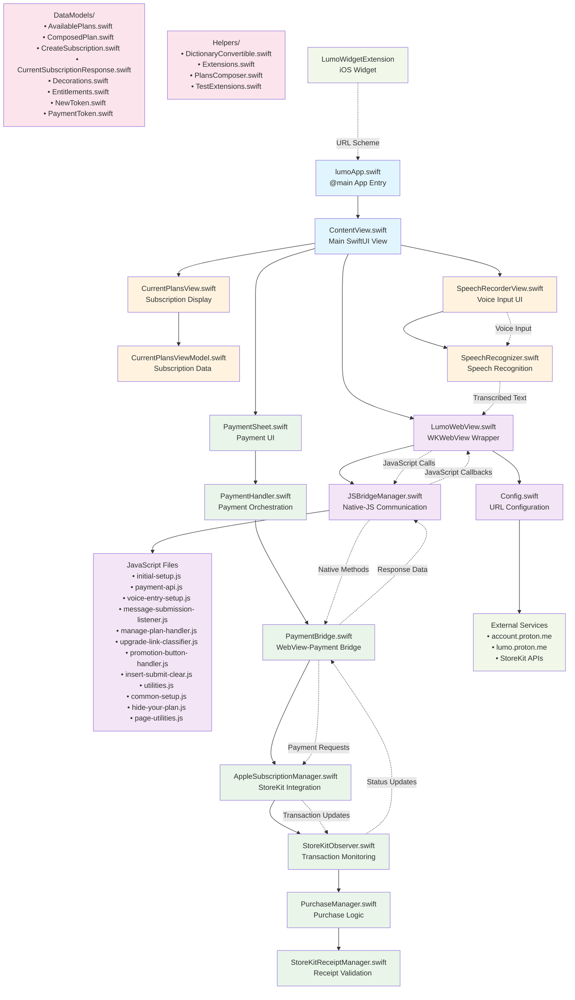

# Lumo iOS App

Lumo is the privacy-first AI assistant created by Proton, the team behind encrypted email, VPN, password manager, and cloud storage trusted by over 100 million people. 

Lumo helps you stay productive, curious, and informed — without ever compromising your privacy. 

Here is our SwiftUI-based iOS application that provides a web-based interface for Lumo services with native payment integration and speech recognition capabilities.


## App Architecture


```mermaid
graph TB
    %% App Entry Point
    App["lumoApp.swift
    @main App Entry"] --> ContentView
    
    %% Main Content View
    ContentView["ContentView.swift
    Main SwiftUI View"] --> WebView
    ContentView --> PaymentSheet
    ContentView --> CurrentPlansView
    ContentView --> SpeechRecorderView
    
    %% WebView Layer
    WebView["LumoWebView.swift
    WKWebView Wrapper"] --> JSBridge
    WebView --> Config["Config.swift
    URL Configuration"]
    
    %% JavaScript Bridge
    JSBridge["JSBridgeManager.swift
    Native-JS Communication"] --> JSFiles
    
    %% JavaScript Files
    JSFiles["JavaScript Files
    • initial-setup.js
    • payment-api.js
    • voice-entry-setup.js
    • message-submission-listener.js
    • manage-plan-handler.js
    • upgrade-link-classifier.js
    • promotion-button-handler.js
    • insert-submit-clear.js
    • utilities.js
    • common-setup.js
    • hide-your-plan.js
    • page-utilities.js"]
    
    %% Payment System
    PaymentSheet["PaymentSheet.swift
    Payment UI"] --> PaymentHandler
    PaymentHandler["PaymentHandler.swift
    Payment Orchestration"] --> PaymentBridge
    PaymentBridge["PaymentBridge.swift
    WebView-Payment Bridge"] --> AppleSubscriptionManager
    AppleSubscriptionManager["AppleSubscriptionManager.swift
    StoreKit Integration"] --> StoreKitObserver
    StoreKitObserver["StoreKitObserver.swift
    Transaction Monitoring"] --> PurchaseManager
    PurchaseManager["PurchaseManager.swift
    Purchase Logic"] --> StoreKitReceiptManager
    StoreKitReceiptManager["StoreKitReceiptManager.swift
    Receipt Validation"]
    
    %% UI Components
    CurrentPlansView["CurrentPlansView.swift
    Subscription Display"] --> CurrentPlansViewModel
    CurrentPlansViewModel["CurrentPlansViewModel.swift
    Subscription Data"]
    
    SpeechRecorderView["SpeechRecorderView.swift
    Voice Input UI"] --> SpeechRecognizer
    SpeechRecognizer["SpeechRecognizer.swift
    Speech Recognition"]
    
    %% Data Models
    DataModels["DataModels/
    • AvailablePlans.swift
    • ComposedPlan.swift
    • CreateSubscription.swift
    • CurrentSubscriptionResponse.swift
    • Decorations.swift
    • Entitlements.swift
    • NewToken.swift
    • PaymentToken.swift"]
    
    %% Helpers & Utilities
    Helpers["Helpers/
    • DictionaryConvertible.swift
    • Extensions.swift
    • PlansComposer.swift
    • TestExtensions.swift"]
    
    %% External Services
    Config --> ExternalServices["External Services
    • account.proton.me
    • lumo.proton.me
    • StoreKit APIs"]
    
    %% Data Flow
    WebView -.->|JavaScript Calls| JSBridge
    JSBridge -.->|Native Methods| PaymentBridge
    PaymentBridge -.->|Payment Requests| AppleSubscriptionManager
    AppleSubscriptionManager -.->|Transaction Updates| StoreKitObserver
    StoreKitObserver -.->|Status Updates| PaymentBridge
    PaymentBridge -.->|Response Data| JSBridge
    JSBridge -.->|JavaScript Callbacks| WebView
    
    %% Speech Flow
    SpeechRecorderView -.->|Voice Input| SpeechRecognizer
    SpeechRecognizer -.->|Transcribed Text| WebView
    
    %% Widget Integration
    Widget[LumoWidgetExtension<br/>iOS Widget] -.->|URL Scheme| App
    
    %% Styling
    classDef appLayer fill:#e1f5fe
    classDef webLayer fill:#f3e5f5
    classDef paymentLayer fill:#e8f5e8
    classDef uiLayer fill:#fff3e0
    classDef dataLayer fill:#fce4ec
    classDef externalLayer fill:#f1f8e9
    
    class App,ContentView appLayer
    class WebView,JSBridge,JSFiles,Config webLayer
    class PaymentSheet,PaymentHandler,PaymentBridge,AppleSubscriptionManager,StoreKitObserver,PurchaseManager,StoreKitReceiptManager paymentLayer
    class CurrentPlansView,CurrentPlansViewModel,SpeechRecorderView,SpeechRecognizer uiLayer
    class DataModels,Helpers dataLayer
    class ExternalServices,Widget externalLayer
```

## Key Features

### 🔐 **Authentication & Session Management**
- WebView-based authentication with Proton services
- Persistent session storage using WKWebsiteDataStore
- Automatic session restoration on app launch

### 💳 **Native Payment Integration**
- StoreKit 2 integration for in-app purchases
- Seamless payment flow between web interface and native iOS
- Subscription management and receipt validation

### 🎤 **Speech Recognition**
- On-device speech recognition for voice input
- Real-time transcription to web interface
- Permission handling and error management

### 🔗 **JavaScript Bridge**
- Bidirectional communication between native iOS and web content
- Payment API integration
- Voice input injection
- UI state management

### 📱 **Widget Support**
- iOS widget for quick access
- URL scheme integration for deep linking
- Prompt sharing between widget and main app

### 🌐 **WebView Management**
- Custom WKWebView configuration
- Zoom prevention and gesture handling
- Navigation interception and external link handling
- Cookie and session data persistence


## Development

### Prerequisites
- macOS with Xcode 26.0+
- iOS 17.6+
- Swift 6.0+
- [Tuist](https://tuist.dev) 4.0+

#### Installing Tuist
The easiest way to install Tuist is using [mise](https://mise.jdx.dev/):

```bash
# Install mise
curl https://mise.run | sh

# Install Tuist
mise install tuist
```

### Setup
1. Clone the repository
2. Install dependencies: `tuist install`
3. Generate workspace: `tuist generate`
4. Setup git hooks (optional but recommended): `./scripts/setup-git-hooks.sh`
   - Installs pre-commit hook that auto-formats Swift code with `swift-format`
5. Open the project in Xcode:
   - **`Lumo.xcodeproj`** - For regular development (recommended for most cases)
   - **`Lumo.xcworkspace`** - Only if you need to browse/edit dependency source code (Lottie, ProtonUIFoundations, etc.)
6. Select the **LumoApp** scheme (production)
7. Build and run

> **Note:** After modifying `Project.swift` or `Package.swift`, run `tuist generate` to regenerate the workspace.
>
> **Workspace vs Project:** Both work for building and running the app. The workspace includes dependency projects (Lottie, ProtonUIFoundations, swift-collections, swiftui-introspect) for direct source code access, while the project file resolves dependencies automatically. Use the workspace only when you need to debug or modify dependency code.

### Available Schemes
- **LumoApp** - Production build pointing to `lumo.proton.me`
- **LumoApp-Dev** - Development build pointing to `lumo.proton.dev` (requires local web client setup)

### Local Development Setup (lumo.proton.dev)

For developing against a local web client, use the **LumoApp-Dev** scheme.

#### Prerequisites
- Access to `proton/web/clients` repository with local-sso configured and running
- HAProxy: `brew install haproxy`
- Bash 5.x+: `brew install bash`
- mkcert: `brew install mkcert`

#### One-time Setup per Machine

**1. Start the web server (automatically generates certificates)**

When you run `yarn start-all` for the first time, it automatically generates SSL certificates if they don't exist:

```bash
cd <path-to-proton-web-clients>
yarn start-all --applications "proton-account proton-lumo" --api proton.black --no-error-logs
```

This will:
- Generate SSL certificates for `*.proton.dev` (saved in `utilities/local-sso/`)
- Install mkcert root CA in macOS system keychain
- Configure `/etc/hosts` for local development domains
- Start HAProxy and the development server

The root CA is created at `/Users/<username>/Library/Application Support/mkcert/rootCA.pem`

**⚠️ IMPORTANT: Check your bash version before running yarn**

System bash (3.2) may cause the dev server to resolve to the latest master version instead of your local environment. Use Homebrew bash (5.x):

```bash
which bash
# /opt/homebrew/bin/bash

bash --version
# GNU bash, version 5.x or higher
```

If `which bash` shows `/bin/bash`, fix your PATH order to prioritize Homebrew.

**Note:** Certificates are generated only once. Subsequent runs of `yarn start-all` will reuse existing certificates.

**2. Install root CA in iOS Simulator**

```bash
xcrun simctl keychain booted add-root-cert "/Users/$(whoami)/Library/Application Support/mkcert/rootCA.pem"
```

**Note:**
- Re-run this command after creating/resetting a simulator
- If you regenerate the root CA (with `mkcert -install` or `./generate-certificate.sh`), you must reset the simulator keychain and add the new certificate:
  ```bash
  xcrun simctl keychain booted reset
  xcrun simctl keychain booted add-root-cert "/Users/$(whoami)/Library/Application Support/mkcert/rootCA.pem"
  ```

**3. Build and run**

In Xcode:
1. Select **LumoApp-Dev** scheme
2. Clean Build (Cmd+Shift+K)
3. Run on Simulator (Cmd+R)

#### How Local Development Works

1. iOS app connects to `https://lumo.proton.dev`
2. `/etc/hosts` resolves to `127.0.0.1` (configured in `proton/web/clients`)
3. HAProxy (port 443) proxies requests:
   - Frontend → local webpack dev server
   - API → production backend (`lumo.proton.black`)
4. HAProxy serves the SSL certificate for `*.proton.dev` (signed by mkcert root CA)
5. iOS Simulator trusts the certificate because the root CA is installed in its keychain

#### Configuration Files
- **Xcconfigs/Debug-Dev.xcconfig**: URLs set to `https://lumo.proton.dev` for local development
- **Xcconfigs/Debug.xcconfig** and **Release.xcconfig**: URLs set to production endpoints
- **Info-Dev.plist**: Used by **LumoApp-Dev** scheme (includes localhost networking exceptions)
- **Info.plist**: Used by **LumoApp** scheme (production configuration)
- **Config.swift**: Reads configuration values from Info.plist/Info-Dev.plist (populated from xcconfig files)

URL configuration is managed through xcconfig files, which populate Info.plist values at build time. The **LumoApp-Dev** scheme uses `Info-Dev.plist` + `Debug-Dev.xcconfig`, while **LumoApp** uses `Info.plist` + standard configurations.

## License
The code and data files in this distribution are licensed under the terms of the GNU General Public License as 
published by the Free Software Foundation, either version 3 of the License, or (at your option) any later version. 
See https://www.gnu.org/licenses/ for a copy of this license.

See [LICENSE](LICENSE) file