# Lumo iOS App

Lumo is the privacy-first AI assistant created by Proton, the team behind encrypted email, VPN, password manager, and cloud storage trusted by over 100 million people. 

Lumo helps you stay productive, curious, and informed — without ever compromising your privacy. 

Here is our SwiftUI-based iOS application that provides a web-based interface for Lumo services with native payment integration and speech recognition capabilities.


## App Architecture

```mermaid
graph TB
    %% App Entry Point
    App["lumoApp.swift
    @main App Entry"] --> ContentView
    
    %% Main Content View
    ContentView["ContentView.swift
    Main SwiftUI View"] --> WebView
    ContentView --> PaymentSheet
    ContentView --> CurrentPlansView
    ContentView --> SpeechRecorderView
    
    %% WebView Layer
    WebView["LumoWebView.swift
    WKWebView Wrapper"] --> JSBridge
    WebView --> Config["Config.swift
    URL Configuration"]
    
    %% JavaScript Bridge
    JSBridge["JSBridgeManager.swift
    Native-JS Communication"] --> JSFiles
    
    %% JavaScript Files
    JSFiles["JavaScript Files
    • initial-setup.js
    • payment-api.js
    • voice-entry-setup.js
    • message-submission-listener.js
    • manage-plan-handler.js
    • upgrade-link-classifier.js
    • promotion-button-handler.js
    • insert-submit-clear.js
    • utilities.js
    • common-setup.js
    • hide-your-plan.js
    • page-utilities.js"]
    
    %% Payment System
    PaymentSheet["PaymentSheet.swift
    Payment UI"] --> PaymentHandler
    PaymentHandler["PaymentHandler.swift
    Payment Orchestration"] --> PaymentBridge
    PaymentBridge["PaymentBridge.swift
    WebView-Payment Bridge"] --> AppleSubscriptionManager
    AppleSubscriptionManager["AppleSubscriptionManager.swift
    StoreKit Integration"] --> StoreKitObserver
    StoreKitObserver["StoreKitObserver.swift
    Transaction Monitoring"] --> PurchaseManager
    PurchaseManager["PurchaseManager.swift
    Purchase Logic"] --> StoreKitReceiptManager
    StoreKitReceiptManager["StoreKitReceiptManager.swift
    Receipt Validation"]
    
    %% UI Components
    CurrentPlansView["CurrentPlansView.swift
    Subscription Display"] --> CurrentPlansViewModel
    CurrentPlansViewModel["CurrentPlansViewModel.swift
    Subscription Data"]
    
    SpeechRecorderView["SpeechRecorderView.swift
    Voice Input UI"] --> SpeechRecognizer
    SpeechRecognizer["SpeechRecognizer.swift
    Speech Recognition"]
    
    %% Data Models
    DataModels["DataModels/
    • AvailablePlans.swift
    • ComposedPlan.swift
    • CreateSubscription.swift
    • CurrentSubscriptionResponse.swift
    • Decorations.swift
    • Entitlements.swift
    • NewToken.swift
    • PaymentToken.swift"]
    
    %% Helpers & Utilities
    Helpers["Helpers/
    • DictionaryConvertible.swift
    • Extensions.swift
    • PlansComposer.swift
    • TestExtensions.swift"]
    
    %% External Services
    Config --> ExternalServices["External Services
    • account.proton.me
    • lumo.proton.me
    • StoreKit APIs"]
    
    %% Data Flow
    WebView -.->|JavaScript Calls| JSBridge
    JSBridge -.->|Native Methods| PaymentBridge
    PaymentBridge -.->|Payment Requests| AppleSubscriptionManager
    AppleSubscriptionManager -.->|Transaction Updates| StoreKitObserver
    StoreKitObserver -.->|Status Updates| PaymentBridge
    PaymentBridge -.->|Response Data| JSBridge
    JSBridge -.->|JavaScript Callbacks| WebView
    
    %% Speech Flow
    SpeechRecorderView -.->|Voice Input| SpeechRecognizer
    SpeechRecognizer -.->|Transcribed Text| WebView
    
    %% Widget Integration
    Widget[LumoWidgetExtension<br/>iOS Widget] -.->|URL Scheme| App
    
    %% Styling
    classDef appLayer fill:#e1f5fe
    classDef webLayer fill:#f3e5f5
    classDef paymentLayer fill:#e8f5e8
    classDef uiLayer fill:#fff3e0
    classDef dataLayer fill:#fce4ec
    classDef externalLayer fill:#f1f8e9
    
    class App,ContentView appLayer
    class WebView,JSBridge,JSFiles,Config webLayer
    class PaymentSheet,PaymentHandler,PaymentBridge,AppleSubscriptionManager,StoreKitObserver,PurchaseManager,StoreKitReceiptManager paymentLayer
    class CurrentPlansView,CurrentPlansViewModel,SpeechRecorderView,SpeechRecognizer uiLayer
    class DataModels,Helpers dataLayer
    class ExternalServices,Widget externalLayer
```



## Key Features

### 🔐 **Authentication & Session Management**
- WebView-based authentication with Proton services
- Persistent session storage using WKWebsiteDataStore
- Automatic session restoration on app launch

### 💳 **Native Payment Integration**
- StoreKit 2 integration for in-app purchases
- Seamless payment flow between web interface and native iOS
- Subscription management and receipt validation

### 🎤 **Speech Recognition**
- On-device speech recognition for voice input
- Real-time transcription to web interface
- Permission handling and error management

### 🔗 **JavaScript Bridge**
- Bidirectional communication between native iOS and web content
- Payment API integration
- Voice input injection
- UI state management

### 📱 **Widget Support**
- iOS widget for quick access
- URL scheme integration for deep linking
- Prompt sharing between widget and main app

### 🌐 **WebView Management**
- Custom WKWebView configuration
- Zoom prevention and gesture handling
- Navigation interception and external link handling
- Cookie and session data persistence


## Development

### Prerequisites
- Xcode 15.0+
- iOS 17.0+
- Swift 5.9+

### Setup
1. Clone the repository
2. Open `lumo.xcodeproj` in Xcode
3. Configure your development team
4. Build and run

### Configuration
Update `Config.swift` with your service endpoints:
```swift
enum Config {
    static let ACCOUNT_BASE_URL = "https://account.proton.me"
    static let LUMO_BASE_URL = "https://lumo.proton.me"
    // ... other endpoints
}
```

## License
The code and data files in this distribution are licensed under the terms of the GNU General Public License as 
published by the Free Software Foundation, either version 3 of the License, or (at your option) any later version. 
See https://www.gnu.org/licenses/ for a copy of this license.

See [LICENSE](LICENSE) file